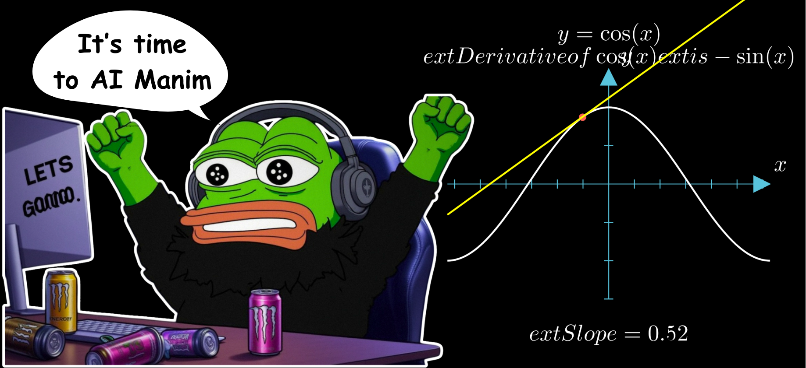

# AnimAI-Trainer

  

## Overview

AnimAI-Trainer is the training module for AnimAI, a framework for generating manim visualizations given a text prompt.

In this repository, we will be handling the data processing, and the model training.

## Plan of Attack (Not definitive)

- ✅ Design verifiers (reward functions) for a given manim code.
- Process open source manim datasets from Hugging Face, and prepare them for training.
- Train the model.
- Release the model.

